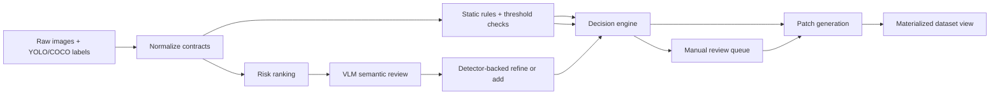
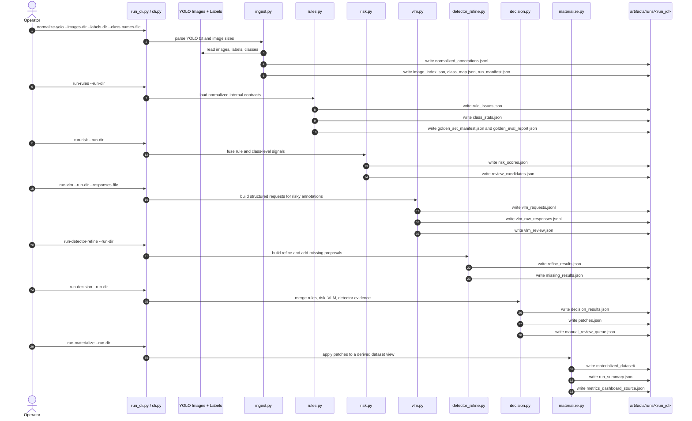

# Architecture Bootstrap

This document translates the SRS into an initial repository shape and module map.

## Repository Layout

| Path | Purpose |
|---|---|
| `configs/` | frozen default policy and threshold examples |
| `docs/` | roadmap, current milestone, stable spec, execution plans, and logs |
| `tasks/` | task-specific discovery, contracts, plans, and validation memory |
| `schemas/` | JSON schema contracts for the minimum interchange files |
| `scripts/` | wrappers for local CLI execution |
| `src/yolo_label_validation/` | bootstrap code and future pipeline modules |
| `tests/` | smoke tests and future regression fixtures |
| `.github/workflows/` | CI gates that mirror local validation |
| `artifacts/runs/` | generated run workspaces; ignored by Git |

## Planned Module Boundaries

| Module | Responsibility | Inputs | Outputs |
|---|---|---|---|
| `contracts.py` | canonical contracts and artifact registry | SRS file contracts | typed Python data and filenames |
| `bootstrap.py` | initialize run workspace | run metadata | empty but valid artifact files |
| `task_docs.py` | scaffold task and context docs | task name, task slug | concrete markdown docs |
| `doc_check.py` | validate task-doc readiness | task folder | blocking findings or pass result |
| `ingest.py` | parse YOLO/COCO and normalize | raw images, labels, class map | `normalized_annotations.jsonl`, `image_index.json`, `class_map.json` |
| `rules.py` | run explicit validation and statistics | normalized annotations, thresholds | `rule_issues.json`, `class_stats.json` |
| `risk.py` | fuse Cleanlab and FiftyOne signals | predictions, labels, stats | `risk_scores.json`, `review_candidates.json` |
| `vlm.py` | build Qwen2.5-VL requests and parse JSON | candidates, crops, prompts | `vlm_requests.jsonl`, `vlm_raw_responses.jsonl`, `vlm_review.json` |
| `decision.py` | merge rules, risk, VLM, and detector evidence | all review outputs | `decision_results.json`, `patches.json`, `manual_review_queue.json` |
| `detector_refine.py` | refine or add boxes with detector B | crops, current boxes | `refine_results.json`, `missing_results.json` |
| `materialize.py` | apply patches into dataset views | source labels, patches | `materialized_dataset/`, export manifests |

## File Naming Rules

- Run workspaces live under `artifacts/runs/<run_id>/`
- Artifact names are frozen in `src/yolo_label_validation/contracts.py`
- Schema files use the pattern `schemas/<artifact>.schema.json`
- Execution plans use `docs/exec-plans/active/EP-XXX-<slug>.md`
- Test files mirror module names with `tests/test_<module>.py`

## Processing Sequence

## YOLO Validation Sequence

## Bootstrap Decision

The first committed code only implements scaffold bootstrap.
FR-001 and FR-002 are the next active engineering target after this
initialization pass. Harness hardening also adds task-scoped docs, a doc gate,
and CI wiring so future milestones start from a repeatable baseline.
